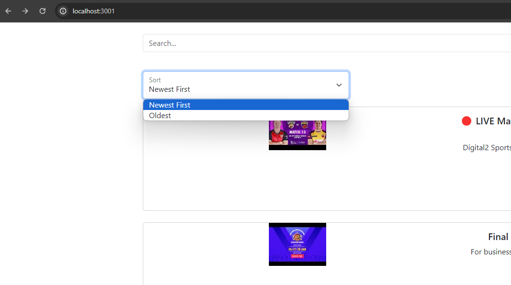
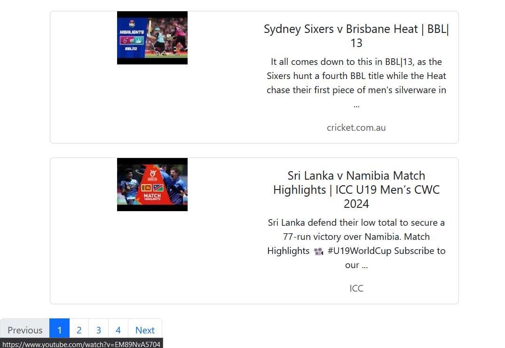

## Youtube Data Fetch
### Installation and setup:
- Intall Docker in the system. [Download here](https://www.docker.com/products/docker-desktop/)

- Clone this repo
    ```
    git clone https://github.com/rishiqwerty/fam-youtube.git
    ```

- Now go to project directory and run this command
    ```
        docker-compose up
    ```

- Now the server will start for django and react. Visit http://localhost:3000/

Home page will appear. Here we can sort data by Newest or oldest publishing date


- There is a search input field, videos can be partially searched on title and description

Per page only shows 5 data. We can navigate to different page with next button.

